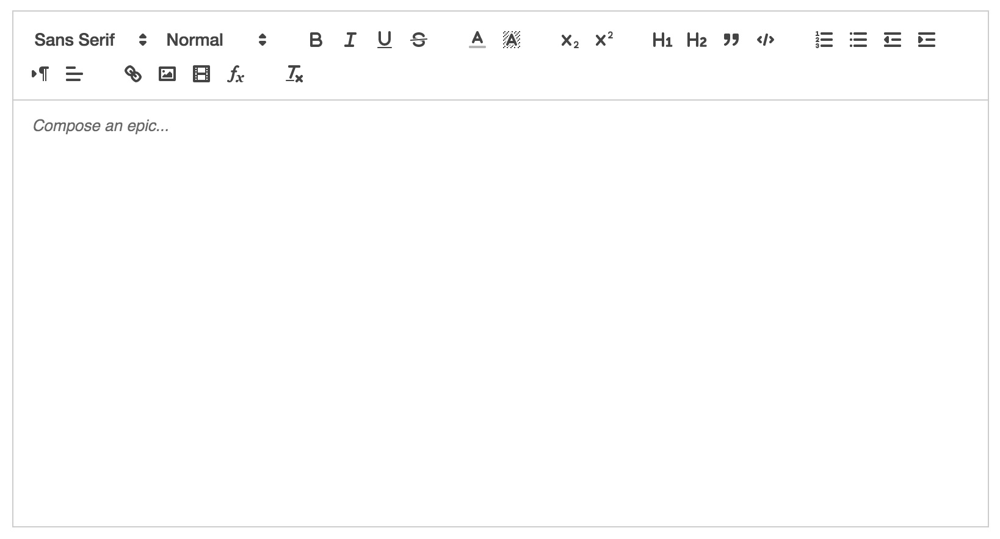

# Foramts

Quill支持多种方式格式化，包括UI控件和API调用。

默认情况下，所有的格式都被允许存在于Quill编辑器中，并且可以使用格式选项进行配置。这与在工具栏中添加空间上是分开的。例如：你可以配置Quill允许将带粗体的内容粘贴到工具栏中没有粗体按钮的编辑器中。

[独立版本](https://quilljs.com/standalone/full/)

## Inline

* Background Color - `background`
* Bold - `bold`
* Color - `color`
* Font - `font`
* Inline Code - `code`
* Italic - `italic`
* Link - `link`
* Size - `size`
* Strikethrough - `strike`
* Superscript/Subscript - `script`
* Underline - `underline`

## Block

* Blockquote - `blockquote`
* Header - `header`
* Indent - `indent`
* List - `list`
* Text Alignment - `align`
* Text Direction - `direction`
* Code Block - `code-block`

## Embeds

* Formula - `formula`
* Image - `image`
* Video - `video`