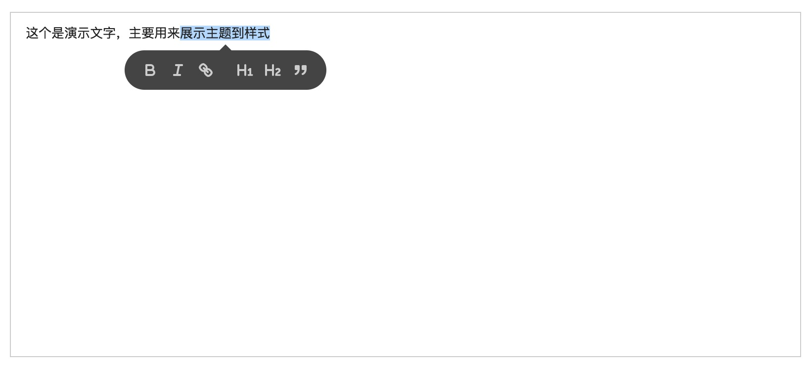
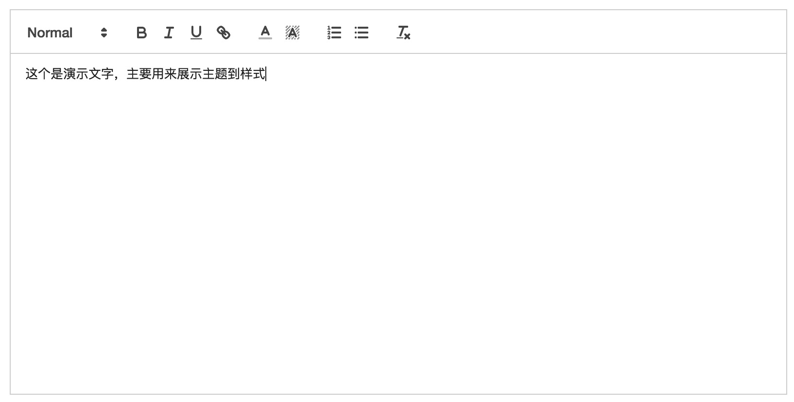

# 主题

主题可以轻松的使你的编辑器看起来很好看。Quill目前有两个主题：[Snow]()和[Bubble]()

## 用法

```
<!-- Add the theme's stylesheet -->
<link rel="stylesheet" href="//cdn.quilljs.com/1.3.4/quill.bubble.css">

<script src="//cdn.quilljs.com/1.3.4/quill.js"></script>
<script>
var quill = new Quill('#editor', {
  theme: 'bubble'   // Specify theme in configuration
});
</script>
```

## Bubble

Bubble是一个简单的基于`tooltip`的主题。



[独立演示](https://quilljs.com/standalone/bubble/)

## Snow

Snow是一个干净的浮动工具栏主题。



[独立演示](https://quilljs.com/standalone/snow/)

## 定制化

主题主要通过其css样式来控制Quill的外观，并且通过覆盖这些规则很容易作出许多改变。与任何其他Web应用程序一样，只需使用浏览器开发控制台检查元素即可查看影响它们的规则，这是最简单的方法。

许多其他定制化可以通过各自的模块完成。例如：工具栏可能是最明显的用户界面，但是大部分的定制工作是通过工具栏模块完成的。
